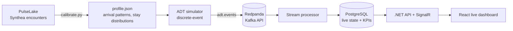

# WardFlow — Real-Time Hospital Operations

Event-driven hospital operations platform: a simulator calibrated on synthetic clinical data streams
HL7 ADT-style patient flow events (registration, admission, transfer, discharge) into a Kafka-compatible
broker, feeding live KPIs such as emergency department census, bed occupancy and boarding time.

> Companion project to [PulseLake](https://github.com/mcorthudayi/pulselake). All data is synthetic.

## Architecture



## Roadmap

- [x] Phase 1 — Calibrated ADT event simulator, Redpanda, topic setup
- [ ] Phase 2 — Stream processor with idempotent state and KPI snapshots
- [ ] Phase 3 — .NET API with SignalR live updates
- [ ] Phase 4 — React live operations dashboard with alerts
- [ ] Phase 5 — Arrival forecasting, CI, one-command setup

## Event schema (`adt.events`, key = `visit_id`)

| `event_type` | `event_name` | Meaning | Extra fields |
|---|---|---|---|
| `A04` | `register` | Patient registered in the emergency department | `acuity` (ESI 1–5) |
| `A08` | `decision_to_admit` | ED physician decides to admit | `target_unit`, `acuity` |
| `A02` | `transfer` | Patient moved from ED to a ward bed | `from_unit`, `bed`, `boarding_minutes` |
| `A01` | `admit` | Direct admission to a ward bed | `bed`, `wait_minutes` |
| `A03` | `discharge` | Patient leaves the ED or a ward | `bed` (ward discharges) |

Every event carries `schema_version`, `event_id` (UUID), `occurred_at` (ISO 8601), `visit_id`,
`patient_key` (random pseudonym) and `unit`. Events for the same visit share a partition key,
so they are consumed in order.

## Simulator

- **Calibrated, not random:** `calibrate.py` learns hour-of-day and day-of-week arrival shapes,
  length-of-stay distributions and the ED-to-admission rate from Synthea encounters, and writes a small
  committed `profile.json`. Sparse counts are Laplace-smoothed; hour and weekday effects are modeled separately.
- **Discrete-event simulation:** non-homogeneous Poisson arrivals, stays sampled from empirical quantiles,
  finite bed capacity per ward, and ED boarding when no bed is free.
- **Self-balancing load:** direct admissions are derived with Little's Law so the hospital settles near
  a target occupancy (85% by default).
- **Warm start:** the hospital starts at 75% occupancy so dashboards are meaningful immediately.
- **Reliable delivery:** idempotent Kafka producer with `acks=all` and per-visit keys.

## Quick start

```bash
python3 -m venv .venv && source .venv/bin/activate
pip install -r simulator/requirements.txt
docker compose up -d --wait
./scripts/create_topics.sh
python simulator/simulate.py
```

Open Redpanda Console at http://localhost:8080 to watch events arrive. Useful flags:
`--speed` (simulated seconds per real second, default 600), `--ed-per-day`, `--target-occupancy`,
`--sim-hours`, `--seed`, `--dry-run`.

To recalibrate from a PulseLake checkout: `python simulator/calibrate.py --input-dir ../pulselake/data/synthea/fhir`.
