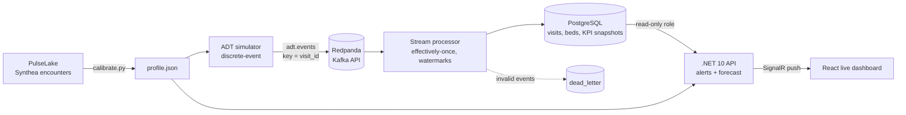

# WardFlow — Real-Time Hospital Operations

[](https://github.com/mcorthudayi/wardflow/actions/workflows/ci.yml)

Event-driven hospital operations platform. A simulator calibrated on synthetic clinical data streams HL7
ADT-style patient flow events into a Kafka-compatible broker; a stream processor maintains live hospital
state with effectively-once guarantees and event-time KPIs; a .NET API pushes the state to a React
operations dashboard over SignalR, with alert rules and a short-term arrival forecast.

> Companion project to [PulseLake](https://github.com/mcorthudayi/pulselake): first the data platform,
> then the operational product built on the same synthetic patients. All data is synthetic.

## Architecture



## Quick start

Requires Docker, Python 3.11+, .NET 10 SDK and Node.js 20+.

```bash
./scripts/up.sh      # dependencies, containers, fresh stream, all services, smoke tests, opens the dashboard
./scripts/down.sh    # stop services (add --all to stop containers too)
```

`up.sh` generates `.env` with random passwords on first run. Simulation speed: `WARDFLOW_SPEED=1200 ./scripts/up.sh`.
Dashboard: http://127.0.0.1:5174 · API: http://localhost:5090/api/overview · Redpanda Console: http://localhost:8080

## Event schema (`adt.events`, key = `visit_id`)

| `event_type` | `event_name` | Meaning | Extra fields |
|---|---|---|---|
| `A04` | `register` | Patient registered in the emergency department | `acuity` (ESI 1–5) |
| `A08` | `decision_to_admit` | ED physician decides to admit | `target_unit`, `acuity` |
| `A02` | `transfer` | Patient moved from ED to a ward bed | `from_unit`, `bed`, `boarding_minutes` |
| `A01` | `admit` | Direct admission to a ward bed | `bed`, `wait_minutes` |
| `A03` | `discharge` | Patient leaves the ED or a ward | `bed` (ward discharges) |

Every event carries `schema_version`, `event_id` (UUID), `occurred_at` (ISO 8601), `visit_id`,
`patient_key` (random pseudonym) and `unit`. Initial-census events carry `source = "census"`.

## Simulator

- **Calibrated, not random:** `calibrate.py` learns hour-of-day and day-of-week arrival shapes,
  length-of-stay distributions and the ED-to-admission rate from Synthea encounters and writes a committed
  `profile.json`. Sparse counts are Laplace-smoothed.
- **Benchmarked where the source is weak:** Synthea under-represents ED admissions, so the observed rate is
  kept in the profile but floored at a configurable clinical benchmark (15% by default).
- **Discrete-event simulation:** non-homogeneous Poisson arrivals, stays sampled from empirical quantiles,
  finite bed capacity per ward and ED boarding when no bed is free.
- **Self-balancing load:** direct admissions are derived with Little's Law so the hospital settles near a
  target occupancy (85% by default).
- **Unbiased warm start:** the initial census is drawn with length-biased sampling. Patients present at any
  moment over-represent long stays (the inspection paradox); sampling them naively drains the hospital.
- **Reliable delivery:** idempotent Kafka producer with `acks=all` and per-visit keys, so each visit's events
  stay ordered within a partition.

## Stream processor

- **Effectively-once state:** consumption is at-least-once; every `event_id` is recorded in
  `ops.processed_events` in the same transaction that applies it, so redelivered events are skipped.
- **Commit ordering:** each batch is committed to PostgreSQL first and to Kafka second. A crash in between
  causes redelivery, which the idempotency ledger absorbs.
- **Per-event savepoints:** a malformed or inconsistent event is rolled back on its own and written to
  `ops.dead_letter` with the reason; the rest of the batch and the stream keep flowing.
- **Order-independent bed state:** a bed passes between visits whose events live on different partitions.
  Assignments are last-writer-wins by event time and releases only apply to the current holder; stale
  assignments are detected and counted.
- **Event-time watermarks:** progress is tracked per partition and the low watermark marks the simulated time
  that is complete. KPI snapshots are written every 15 simulated minutes up to that point and computed from
  visit timelines, so history is identical whether events arrive live or are replayed as a backfill.

## API and dashboard

- **.NET 10 minimal API** backed by a **read-only database role** (`wardflow_api`): it can select from the
  operational schema and nothing else.
- **SignalR push:** a background service detects new snapshots and events and broadcasts the overview to every
  connected dashboard; clients reconnect automatically and backfill missed history over REST.
- **Alert rules:** ward occupancy (85% / 95%), ED crowding, ED boarding (4 / 8 patients), average boarding time
  (2 h / 4 h), rejected events and forecast arrival peaks.
- **Arrival forecast:** a seasonal Poisson model. The hour-of-day and weekday shape comes from the Synthea
  calibration; the level is re-estimated from the last 24 hours of observed arrivals. The next 6 hours are
  forecast with 80% intervals, and the mean absolute error over the last 12 hours is reported alongside.

| Endpoint | Returns |
|---|---|
| `GET /api/overview` | Latest KPIs, unit status, alerts, boarding list, recent events, forecast |
| `GET /api/kpis?hours=24` | KPI snapshot history |
| `GET /api/forecast` | Arrival forecast with intervals and model fit |
| `GET /api/boarding` | Patients waiting in the ED for a bed |
| `GET /api/events/recent?limit=25` | Latest processed events |
| `/hubs/ops` | SignalR hub pushing `overview` messages |

## Verification

| Check | What it proves |
|---|---|
| `scripts/check_invariants.sh` | No bed held by a non-inpatient, no inpatient without a bed, no double-booked beds, no ward over capacity |
| `scripts/replay_check.sh` | Rewinding the consumer group and replaying the whole topic leaves the state fingerprint unchanged |
| `scripts/smoke_test.py` | 18 checks: API contract, forecast sanity, SignalR negotiation, security headers, read-only DB role, invariants |
| GitHub Actions | Simulates 72 hours, processes the stream, runs all of the above plus a dead-letter test, builds the dashboard and scans for secrets and vulnerable packages |

## Project layout

```
simulator/   calibrate.py, simulate.py, profile.json
processor/   processor.py (Kafka -> PostgreSQL)
db/          init/001_ops_schema.sql, roles/api_role.sql
api/         WardFlow.Api (.NET 10, SignalR)
dashboard/   React + TypeScript + Vite + Recharts
scripts/     up.sh, down.sh, reset.sh, smoke_test.py, check_invariants.sh, replay_check.sh, ...
```

To recalibrate from a PulseLake checkout: `python simulator/calibrate.py --input-dir ../pulselake/data/synthea/fhir`.

## Screenshot


