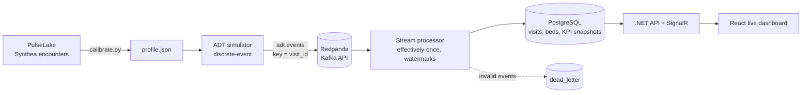

# WardFlow — Real-Time Hospital Operations

Event-driven hospital operations platform: a simulator calibrated on synthetic clinical data streams
HL7 ADT-style patient flow events into a Kafka-compatible broker, and a stream processor maintains live
hospital state and event-time KPIs such as emergency department census, bed occupancy and boarding time.

> Companion project to [PulseLake](https://github.com/mcorthudayi/pulselake). All data is synthetic.

## Architecture



## Roadmap

- [x] Phase 1 — Calibrated ADT event simulator, Redpanda, topic setup
- [x] Phase 2 — Stream processor: effectively-once state, event-time watermarks, dead-letter handling
- [x] Phase 3 — .NET API with SignalR live updates
- [x] Phase 4 — React live operations dashboard with alerts
- [ ] Phase 5 — Arrival forecasting, CI, one-command setup

## Event schema (`adt.events`, key = `visit_id`)

| `event_type` | `event_name` | Meaning | Extra fields |
|---|---|---|---|
| `A04` | `register` | Patient registered in the emergency department | `acuity` (ESI 1–5) |
| `A08` | `decision_to_admit` | ED physician decides to admit | `target_unit`, `acuity` |
| `A02` | `transfer` | Patient moved from ED to a ward bed | `from_unit`, `bed`, `boarding_minutes` |
| `A01` | `admit` | Direct admission to a ward bed | `bed`, `wait_minutes` |
| `A03` | `discharge` | Patient leaves the ED or a ward | `bed` (ward discharges) |

Every event carries `schema_version`, `event_id` (UUID), `occurred_at` (ISO 8601), `visit_id`,
`patient_key` (random pseudonym) and `unit`. Initial-census events carry `source = "census"`.

## Simulator

- **Calibrated, not random:** `calibrate.py` learns hour-of-day and day-of-week arrival shapes,
  length-of-stay distributions and the ED-to-admission rate from Synthea encounters, and writes a committed
  `profile.json`. Sparse counts are Laplace-smoothed; hour and weekday effects are modeled separately.
- **Benchmarked where the source is weak:** Synthea under-represents ED admissions, so the observed rate is
  kept in the profile but floored at a configurable clinical benchmark (15% by default).
- **Discrete-event simulation:** non-homogeneous Poisson arrivals, stays sampled from empirical quantiles,
  finite bed capacity per ward, and ED boarding when no bed is free.
- **Self-balancing load:** direct admissions are derived with Little's Law so the hospital settles near a
  target occupancy (85% by default).
- **Unbiased warm start:** the initial census is drawn with length-biased sampling. Patients present at any
  given moment over-represent long stays (the inspection paradox); sampling them naively drains the hospital
  within days.
- **Reliable delivery:** idempotent Kafka producer with `acks=all` and per-visit keys.

## Stream processor

- **Effectively-once state:** consumption is at-least-once; every `event_id` is recorded in
  `ops.processed_events` in the same transaction that applies it, so redelivered events are skipped.
- **Commit ordering:** each batch is committed to PostgreSQL first and to Kafka second. A crash in between
  causes redelivery, which the idempotency ledger absorbs.
- **Per-event savepoints:** a malformed or inconsistent event is rolled back on its own and written to
  `ops.dead_letter` with the reason; the rest of the batch and the stream keep flowing.
- **Order-independent bed state:** a bed passes between visits whose events live on different partitions,
  so they can be processed in any order. Assignments are last-writer-wins by event time and releases only
  apply to the current holder; stale assignments are detected and counted.
- **Event-time watermarks:** progress is tracked per partition, and the low watermark (the minimum across
  partitions) marks the point in simulated time that is complete. KPI snapshots are written every 15
  simulated minutes up to that point and are computed from visit timelines rather than current tables, so
  the history is identical whether events are processed live or replayed as a fast backfill.

## Verification

| Script | What it proves |
|---|---|
| `scripts/check_invariants.sh` | No bed held by a non-inpatient, no inpatient without a bed, no double-booked beds, no ward over capacity |
| `scripts/replay_check.sh` | Rewinding the consumer group and replaying the whole topic leaves the state fingerprint unchanged |

## Quick start

```bash
cp .env.example .env
sed -i '' "s/^POSTGRES_PASSWORD=.*/POSTGRES_PASSWORD=$(openssl rand -hex 24)/" .env
python3 -m venv .venv && source .venv/bin/activate
pip install -r simulator/requirements.txt -r processor/requirements.txt
docker compose up -d --wait
./scripts/reset.sh
python processor/processor.py &
WARDFLOW_BROKERS=127.0.0.1:19092 python simulator/simulate.py
```

Redpanda Console: http://localhost:8080. Useful simulator flags: `--speed` (simulated seconds per real
second, default 600, `0` for as fast as possible), `--ed-per-day`, `--target-occupancy`,
`--min-admission-rate`, `--sim-hours`, `--seed`, `--dry-run`.

To recalibrate from a PulseLake checkout: `python simulator/calibrate.py --input-dir ../pulselake/data/synthea/fhir`.
